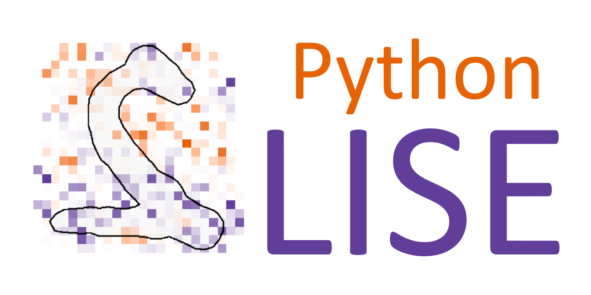
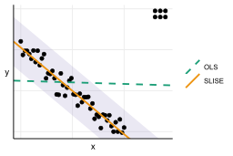
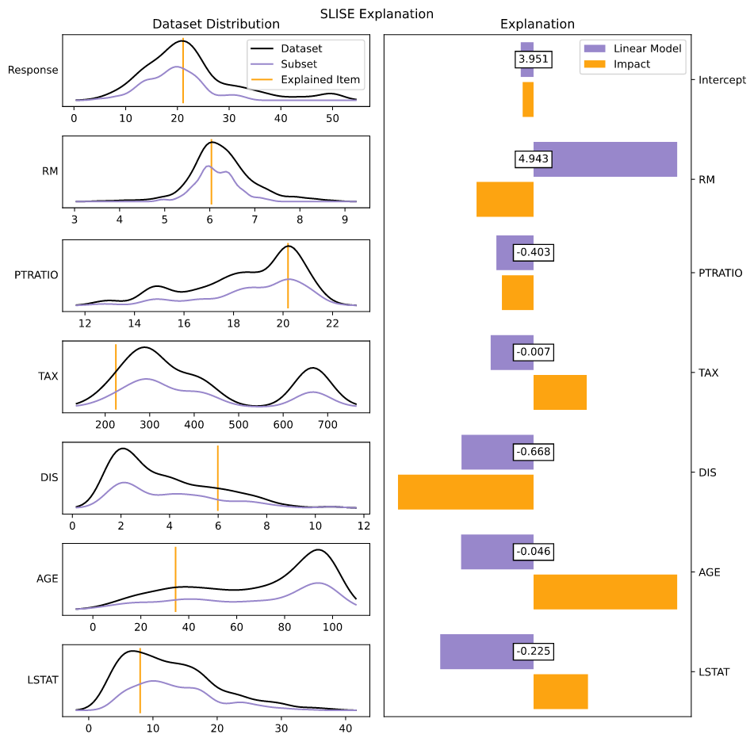

# SLISE - Sparse Linear Subset Explanations

Python implementation of the SLISE algorithm. The SLISE algorithm can be used for both robust regression and to explain outcomes from black box models.
For more details see [the original paper](https://rdcu.be/bVbda) or the [robust regression paper](https://rdcu.be/cFRHD).
Alternatively for a more informal overview see [the presentation](https://github.com/edahelsinki/slise/raw/master/vignettes/presentation.pdf), or [the poster](https://github.com/edahelsinki/slise/raw/master/vignettes/poster.pdf).

> *Björklund A., Henelius A., Oikarinen E., Kallonen K., Puolamäki K.* (2019)  
> **Sparse Robust Regression for Explaining Classifiers.**  
> Discovery Science (DS 2019).  
> Lecture Notes in Computer Science, vol 11828, Springer.  
> https://doi.org/10.1007/978-3-030-33778-0_27  

> *Björklund A., Henelius A., Oikarinen E., Kallonen K., Puolamäki K.* (2022).  
> **Robust regression via error tolerance.**  
> Data Mining and Knowledge Discovery.  
> https://doi.org/10.1007/s10618-022-00819-2  

## The idea

In robust regression we fit regression models that can handle data that contains outliers (see the example below for why outliers are problematic for normal regression). SLISE accomplishes this by fitting a model such that the largest possible subset of the data items have an error less than a given value. All items with an error larger than that are considered potential outliers and do not affect the resulting model.

SLISE can also be used to provide *local model-agnostic explanations* for outcomes from black box models. To do this we replace the ground truth response vector with the predictions from the complex model. Furthermore, we force the model to fit a selected item (making the explanation local). This gives us a local approximation of the complex model with a simpler linear model (this is similar to, e.g., [LIME](https://github.com/marcotcr/lime) and [SHAP](https://github.com/slundberg/shap)). In contrast to other methods SLISE creates explanations using real data (not some discretised and randomly sampled data) so we can be sure that all inputs are valid (i.e. in the correct data manifold, and follows the constraints used to generate the data, e.g., the laws of physics).

## Installation

To install this package just run:

```sh
pip install slise
```

Or install the latest version directly from GitHub with:

```sh
pip install https://github.com/edahelsinki/pyslise
```

Alternatively you can download the repo and run `python -m build` to build a wheel, or `pip install .` to install it locally.

### Other Languages

The (original) R implementation can be found [here](https://github.com/edahelsinki/slise).

## Examples

Here are two quick examples of SLISE in action. For more detailed examples, with descriptions on how to create and interpret them, see the [examples](https://github.com/edahelsinki/pyslise/tree/master/examples) directory.

>   
> SLISE is a robust regression algorithm, which means that it is able to handle outliers. This is in contrast to, e.g., ordinary least-squares regression, which gives skewed results when outliers are present.

&nbsp;
>   
> SLISE can also be used to explain outcomes from black box models by locally approximating the complex models with a simpler linear model.

## Dependencies

This implementation requires Python 3 and the following packages:

- matplotlib
- numba
- numpy
- PyLBFGS
- scipy
